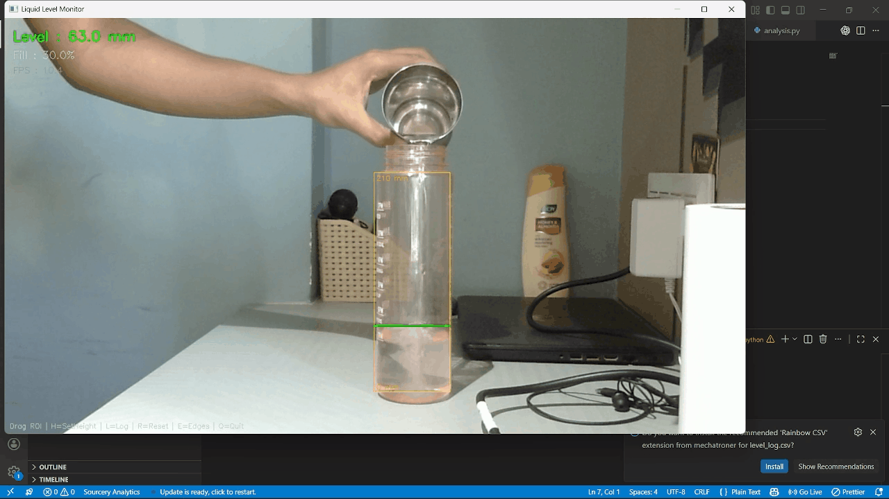
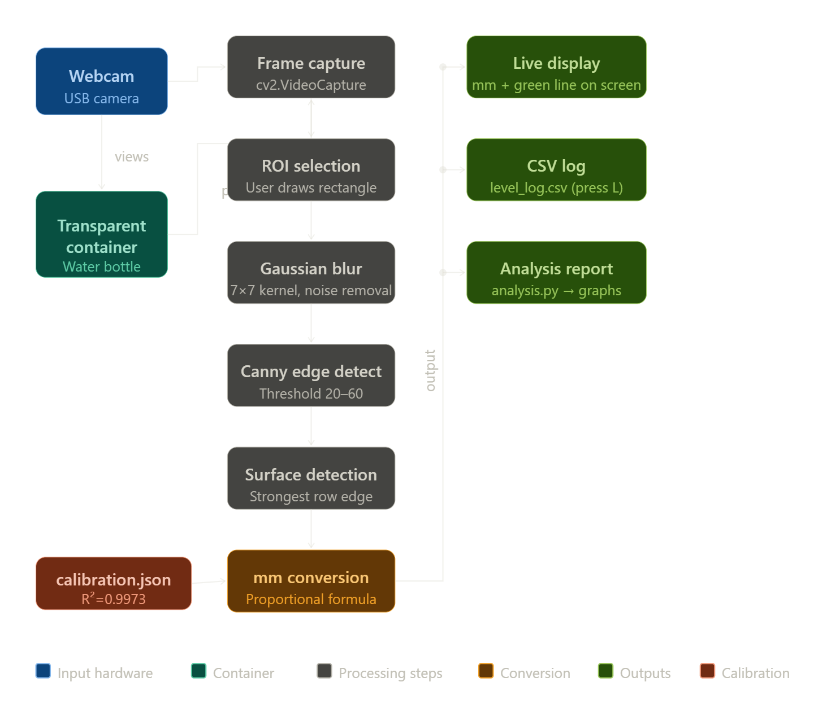

# 🧪 Non-Contact Liquid Level Measurement using Computer Vision

  

A real-time, non-contact liquid level measurement system using a standard USB webcam and Python-based image processing. The system detects the water surface in a transparent container and outputs the level in millimeters — without any physical sensor.

---

## 🚀 Overview

This project uses computer vision techniques to measure liquid levels in real time. By analyzing video frames from a webcam, the system identifies the liquid surface and converts pixel data into real-world measurements.

✔ No physical sensors  
✔ Works with any transparent container  
✔ Real-time measurement  

---

## 🔄 System Flow

---

## 🛠️ Tech Stack

- **Language:** Python 3  
- **Libraries:** OpenCV, NumPy, Matplotlib, SciPy  
- **Hardware:** USB Webcam (720p), Windows PC  
- **Camera Backend:** DirectShow (`CAP_DSHOW`)  

---

## 🧠 System Architecture

### 1. Calibration Module (`calibrate.py`)
- User clicks reference points on container markings  
- Maps pixel coordinates to real-world height (mm)  
- Uses linear regression (`np.polyfit`)  
- Achieved **R² = 0.9973** (high accuracy)  
- Stores calibration data in `calibration.json`  

---

### 2. Real-Time Detection (`main.py`)

Processing pipeline:
Frame → Grayscale → Gaussian Blur → Canny Edge Detection → Dilation
→ Row-wise Edge Sum → Smoothing → Argmax → Water Surface Detection

- Detects strongest horizontal edge as liquid surface  
- Converts pixel position → real-world measurement (mm)  
- Supports dynamic **ROI (Region of Interest)**  
- Works across different container sizes  

#### Key Features:
- **Empty Detection:** Prevents false readings when container is empty  
- **ROI-based system:** User-defined measurement area  
- **Real-time output (~10 FPS)**  

#### Controls:
- `L` → Log measurement to CSV  
- `E` → Toggle edge view  
- `R` → Reset ROI  
- `H` → Set real-world ROI height  

---

### 3. Analysis Module (`analysis.py`)

Generates performance insights:

- Calibration curve with regression line  
- Level vs time graph  
- Error analysis (absolute & percentage)  
- Accuracy table  

Outputs:
- `analysis_report.png`  
- Performance metrics (resolution, error, std deviation)  

---

## 📊 Performance

| Parameter | Value |
|----------|------|
| Calibration R² | 0.9973 |
| Resolution | ~0.41 mm/pixel |
| Frame Rate | ~10 FPS |
| Detection Method | Canny Edge Detection |

---

## ⚙️ Key Design Decisions

- **Canny Edge Detection over HSV:** More robust under lighting variations  
- **Argmax-based detection:** Avoids false edges from markings  
- **ROI-based scaling:** Makes system container-independent  
- **Thresholding:** Prevents noise when container is empty  

---

## 📁 Output Files

- `calibration.json` → Calibration parameters  
- `level_log.csv` → Timestamped readings  
- `analysis_report.png` → Performance visualization  

---

## 🔬 Why Non-Contact?

The system uses only a webcam placed 20–40 cm away from the container.  
No physical sensor interacts with the liquid, making it ideal for:

- hazardous liquids  
- sterile environments  
- corrosive substances  

---

## 🏁 Conclusion

This project demonstrates how computer vision can replace traditional sensors for measurement tasks, offering a scalable and flexible solution for real-world applications.

---

## 📌 Future Improvements

- Improve FPS with optimized processing  
- Add multi-container detection  
- Integrate deep learning-based segmentation  
- Deploy as real-time web application  

---
